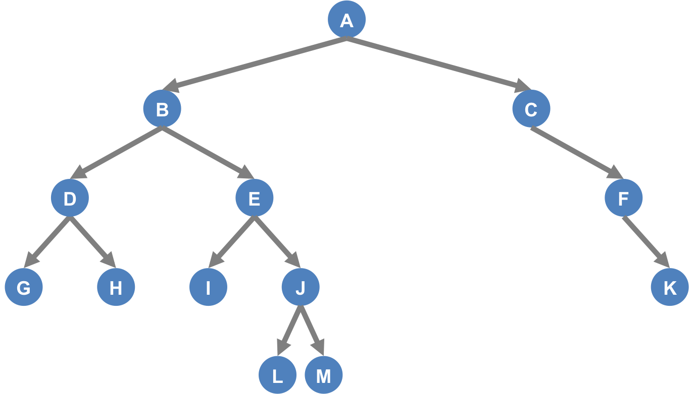

Week 5 Part 1 Practice Problems
========================

Learning Objectives
-------------------
- Binary Tree

Problem 1
---------

**What is the depth of the tree below?**

        

        
  

Problem 2
---------

**Given the values 3, 1, 4, 6, 9, 3, 5, 7**

a) Show the result of inserting these values into an initially empty Binary Search Tree.

b) Show the result of deleting the root.

  