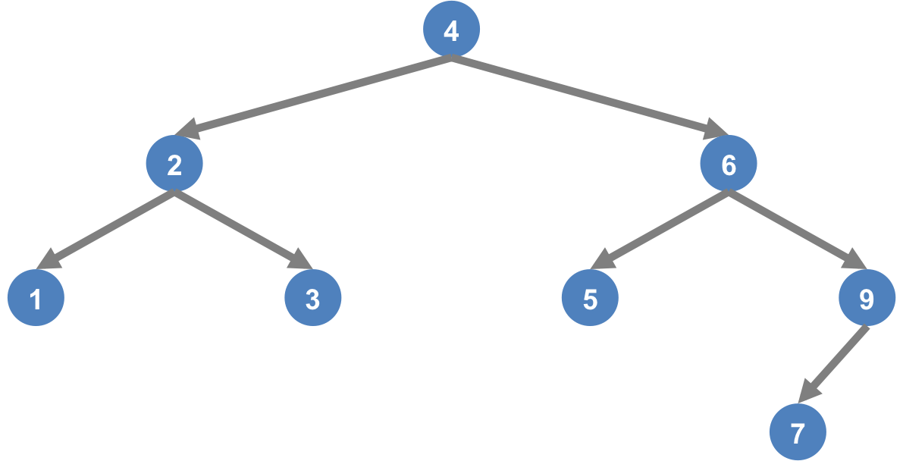
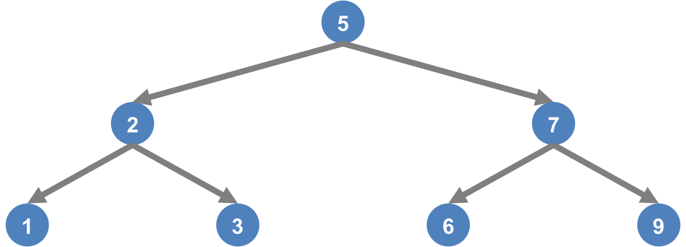

Week 5 Part 2 Practice Problems Example Solutions
=================================================

Learning Objectives
-------------------
- AVL Tree

Problem 1
---------

**Given the values 2, 1, 4, 5, 9, 3, 6, 7**

a) After inserting 2, 1, 4, 5, 9, 3, 6, 7 into an initially empty AVL tree.

        

        
  

b) The result of deleting the root.

        
