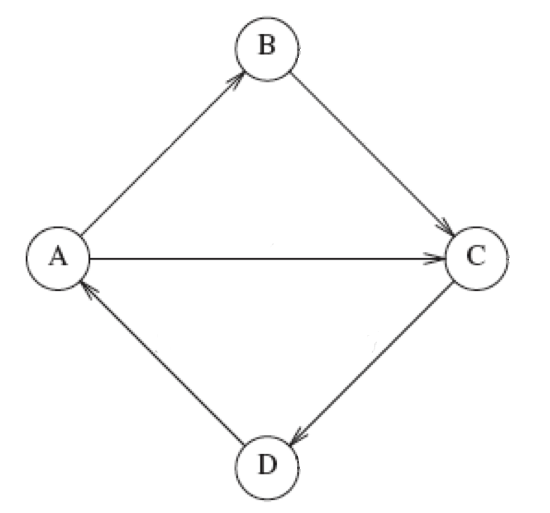
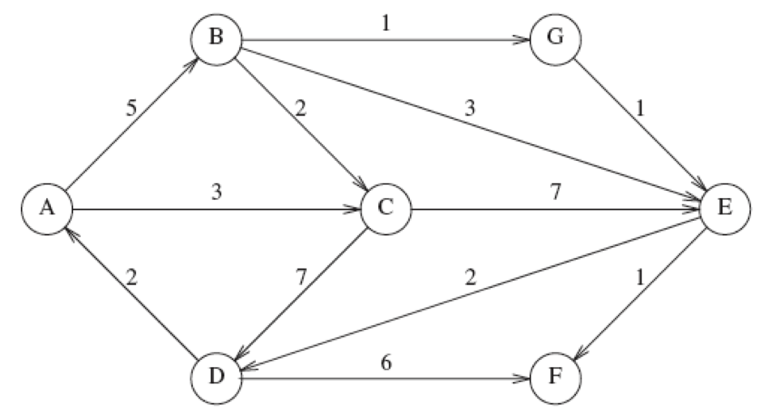

Week 11 Part 1 Practice Problems
========================

Learning Objectives
-------------------
- Adjacency List in Graphs

  

Problem 1
---------

**Write the adjacency list for the graph below. **

        

Note: Assume that the cost of all edges is 1.

        
  

Problem 2
---------

**Write the adjacency list for the graph below where edges have a cost associated with them.**

        

  