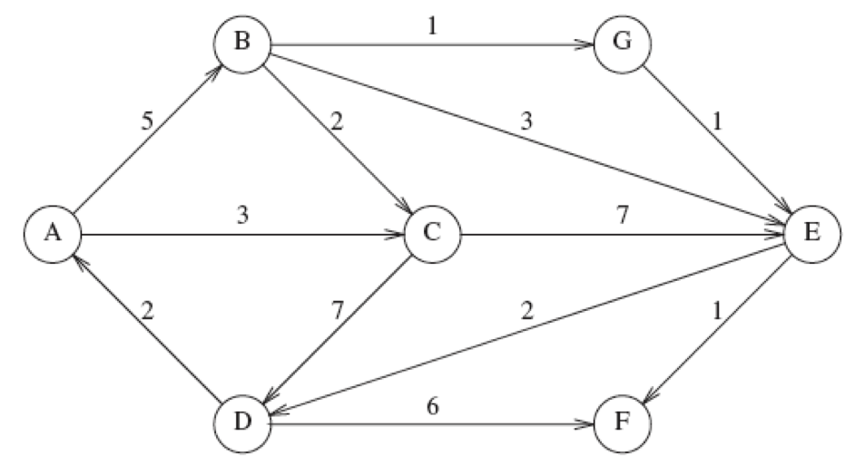

Week 11 Part 2 Practice Problems
========================

Learning Objectives
-------------------
- Adjacency List in Graphs

  

Problem 1
---------

**Given the graph below apply Djkstra's algorithm to parts a and b.**

        

a) Find the shortest path from `A` to all other vertices.

b) Find the shortest path unweighted path from `B` to all other vertices.

  